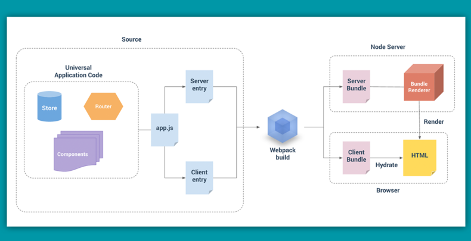

# 24.2 带你走近Vue服务器端渲染

服务器端渲染的 Vue.js 应用程序，是使vue应用既可以在客户端（浏览器）执行，也可以在服务器端执行，我们称之为`“同构”`或“通用”。



之所以能够实现同构，是因为在客户端和服务端都创建了 vue 应用程序，并都用 webpack 进行打包，生成了`server bundle` 和 `client bundle`。`server bundle`用于服务器渲染，`client bundle`是一个客户端的静态标记，服务器渲染好`html`页面片段后，会发送给客户端，然后混合客户端静态标记，这样应用就具有vue应用的特性。

**需要注意是**：

- 服务器端渲染过程中，只会调用 `beforeCreate` 和 `created` 两个钩子函数，其它的只会在客户端执行。那么以前 spa 应用中，在 `created` 中创建一个 `setInterval`，然后在 `destroyed` 中将其销毁的类似操作就不能出现了，服务器渲染期间不会调用`销毁钩子函数`，所以这个定时器会永远保留下来，服务器很容易就崩了。
- 由于服务器可客户端是两种不同的执行平台环境，那么一些特定平台的 API 就不能用了，比如 `window` 和`document`，在 node.js（比如 created 钩子函数）中执行就会报错。并且，我们使用的第三方API中，需要确保能在 node 和浏览器都能正常运行，比如 `axios` ，它向服务器和客户端都暴露相同的 API（浏览器的源生 XHR 就不行）。

### 第一层：服务器渲染从0到1

我们先不考虑同构、不考虑各种配置，先实现一个基础的服务器端渲染demo。

**准备**:

```bash
npm install vue vue-server-renderer express --save
```

`vue-server-renderer` 是 vue 服务器端渲染的核心模块，它需要匹配你的 vue 版本。安装 `express` 是因为我们等会会使用它来起个服务看到我们的页面效果。

**三步渲染一个Vue实例**:

```js
// 第 1 步：创建一个 Vue 实例
const Vue = require('vue')
const app = new Vue({
  template: `<div>Hello Vue SSR</div>`
})

// 第 2 步：创建一个 renderer
const renderer = require('vue-server-renderer').createRenderer()

// 第 3 步：将 Vue 实例渲染为 HTML
renderer.renderToString(app, (err, html) => {
  if (err) throw err
  console.log(html)   // <div data-server-rendered="true">Hello Vue SSR</div>
})
```

**使用模板**:

上面只是生产了一个 `html` 代码片段，一般来说，需要将 `html` 片段插入一个模板文件里。OK，那我们就来写一个模板文件 `index.html`。

```html
<!-- index.html -->
<!DOCTYPE html>
<html lang="en">
  <head><title>Hello</title></head>
  <body>
    <!--vue-ssr-outlet-->
  </body>
</html>
```

在渲染的时候，html 片段会被插入到 `<!--vue-ssr-outlet-->` 这个注释标记这里。

```js
const Vue = require('vue')
const app = new Vue({
  template: `<div>Hello Vue SSR</div>`
})
const renderer = require('vue-server-renderer').createRenderer({
  template: require('fs').readFileSync('./index.html', 'utf-8')
})
renderer.renderToString(app, (err, html) => {
  if (err) throw err
  console.log(html) // html 将是注入应用程序内容的完整页面
})
```

我们用 `fs` 模块将文件读取进来丢入 `render` 的 `template` 中，再重复上述步骤将 `html` 片段插入到我们的标记位。

**在node.js服务器中使用**:

现在，我们将使用 `express` 来启动一个 `node` 服务，验证一下页面效果。

```js
const Vue = require('vue')
// 第一步： 创建一个 express 应用
const server = require('express')()

// 第二步： 创建一个 Vue 实例
const app = new Vue({
  data: {
    msg: 'Hello Vue SSR'
  },
  template: `<div>{{msg}}</div>`
})

// 第三步： 创建一个 renderer
const renderer = require('vue-server-renderer').createRenderer({
  template: require('fs').readFileSync('./index.html', 'utf-8')
})

// 第四步： 设置路由，"*" 表示任意路由都可以访问它
server.get('*', (req, res) => {
  renderer.renderToString(app, (err, html) => {
    if (err) {
      res.status(500).end('Internal Server Error')
      return
    }
    res.end(html)
  })
})

// 第五步： 启动服务并监听从8080端口进入的所有连接请求
server.listen(8080)
```

这样，我们的一个简单的页面渲染就完成了，看下页面效果和 `Response` 数据。


### 第二层：改造 —— 从SPA到SSR

**准备**:

安装 `vue-cli` (至少v2.x版本)后，使用基础模板搭建个项目

```bash
vue init webpack spa_ssr
cd spa_ssr
```

跑一下确保项目能够正常运行，然后记得安装 `vue-server-renderer` 模块

```bash
npm install vue-server-renderer --save-dev
```

安装完成，我们就开始进入下一步。

**改造 src 下的文件**:

我们需要在 `src` 目录下创建两个 `js`。

```md
src
├── router
│   └── index.js
├── components
│   └── HelloSsr.vue
├── App.vue
├── main.js
├── entry-client.js # 仅运行于浏览器
└── entry-server.js # 仅运行于服务器
```

这两个 `entry` 之后会进行配置，先来改造 `main.js`。
在改造 `main.js` 之前，需要说明一下，因单线程的机制，在服务器端渲染时，过程中有类似于单例的操作，那么所有的请求都会共享这个单例的操作，所以应该使用`工厂函数`来确保每个请求之间的独立性。比如在 `main.js` 中，我们原先直接创建一个`Vue实例`，并`直接挂载到DOM`。现在的 main.js 作为通用 entry 文件，它应该改造成一个可以重复执行的工厂函数，`为每个请求创建新的应用程序实例`。挂载的工作，是由之后的`客户端 entry` 来完成。

```js
import Vue from 'vue'
import App from './App'
import { CreateRouter } from './router'

export function createApp () {
  const router = new CreateRouter()
  const app = new Vue({
    router,
    render: h => h(App)
  })
  return { app, router }
}
```

在 `/router/index.js` 中，我们同样需要使用工厂函数来创建路由实例。然后将路由配置改为 `history` 模式（因为哈希不支持）

```js
import Vue from 'vue'
import Router from 'vue-router'
import HelloSsr from '@/components/HelloSsr'

Vue.use(Router)

export function CreateRouter () {
  return new Router({
    mode: 'history',
    routes: [{
      path: '/ssr',
      name: 'HelloSsr',
      component: HelloSsr
    }]
  })
}
```

接下来我们来写客户端的 entry 和服务器端的 entry。客户端的 entry 要做的很简单，就是将 vue实例挂载到DOM上，只不过，考虑到可能存在异步组件，需要等到路由将异步组件加载完毕，才进行此操作。

```js
// entry-client.js
import { createApp } from './main'
const { app, router } = createApp()

router.onReady(() => {
  app.$mount('#app')
})
```

`服务器 entry` 要做的有两步：`1.解析服务器端路由`；`2.返回一个vue实例用于渲染`。

```js
// entry-server.js
import { createApp } from './main'
export default context => {
  // 因为有可能会是异步路由钩子函数或组件，所以我们将返回一个 Promise，
  // 以便服务器能够等待所有的内容在渲染前，
  // 就已经准备就绪。
  return new Promise((resolve, reject) => {
    const { app, router } = createApp()
    // 设置服务器端 router 的位置
    router.push(context.url)
    // 等到 router 将可能的异步组件和钩子函数解析完
    router.onReady(() => {
      const matchedComponents = router.getMatchedComponents()
      // 匹配不到的路由，执行 reject 函数，并返回 404
      if (!matchedComponents.length) {
        // eslint-disable-next-line
        return reject({ code: 404 })
      }
      // Promise 应该 resolve 应用程序实例，以便它可以渲染
      resolve(app)
    }, reject)
  })
}
```

**webpack 配置**:

vue相关代码已处理完毕，接下来就需要对 `webpack` 打包配置进行修改了。 官方推荐了下面配置：

```md
 build
  ├── webpack.base.conf.js  # 基础通用配置
  ├── webpack.client.conf.js  # 客户端打包配置
  └── webpack.server.conf.js  # 服务器端打包配置
```

我们的项目中的配置文件是 `base`，`dev`，`prod`，现在我们仍然保留这三个配置文件，只需要增加`webpack.server.conf.js`即可。

**webpack.base.conf.js 修改**:

我们首先修改 `webpack.base.conf.js` 的 `entry` 入口配置为：`./src/entry-client.js`，来生成客户端的构建清单 `client manifest`。服务器端的配置由于引用 `base` 配置，entry 会通过 `merge` 覆盖，来指向`server-entry.js`。

```js
// webpack.base.conf.js
module.exports = {
  entry: {
    // app: './src/main.js'
    app: './src/entry-client.js'   // <-修改入口文件改为
  },
  // ...
}
```

**webpack.prod.conf.js 修改**:

在客户端的配置 `prod` 中，我们需要引入一个服务器端渲染的插件 `client-plugin`，用来生成`vue-ssr-client-manifest.json`（用作静态资源注入），同时，我们需要把 `HtmlWebpackPlugin` 给去掉，在SPA应用中，我们用它来生成`index.html`文件，但是这里我们有`vue-ssr-client-manifest.json`之后，服务器端会帮我们做好这个工作。

```js
const VueSSRClientPlugin = require('vue-server-renderer/client-plugin')
// ...
  plugins: [
    new webpack.DefinePlugin({
      'process.env': env,
      'process.env.VUE_ENV': '"client"' // 增加process.env.VUE_ENV
    }),
    // ...
    // 以下内容注释（或去除）
    // new HtmlWebpackPlugin({
    //   filename: config.build.index,
    //   template: 'index.html',
    //   inject: true,
    //   minify: {
    //     removeComments: true,
    //     collapseWhitespace: true,
    //     removeAttributeQuotes: true
    //     // more options:
    //     // https://github.com/kangax/html-minifier#options-quick-reference
    //   },
    //   // necessary to consistently work with multiple chunks via CommonsChunkPlugin
    //   chunksSortMode: 'dependency'
    // }),
    // ...
    // 此插件在输出目录中生成 `vue-ssr-client-manifest.json`。
    new VueSSRClientPlugin()
  ]
// ...
```

**webpack.server.conf.js 配置**:

`server` 配置基本参考官方的配置，这里还是说明下：

1. 我们需要去掉`baseConfig`中的打包`css`的配置;
2. 这里使用了`webpack-node-externals`来加快构建速度和减小打包体积，所以我们要先安装一下它：`npm install webpack-node-externals --save-dev`。
3. 和`prod`配置一样，这里需要引入并使用`server-plugin`插件来生成`vue-ssr-server-bundle.json`。这东西是用来等会做服务器端渲染的。

```js
const webpack = require('webpack')
const merge = require('webpack-merge')
const nodeExternals = require('webpack-node-externals')
const baseConfig = require('./webpack.base.conf.js')
const VueSSRServerPlugin = require('vue-server-renderer/server-plugin')
// 去除打包css的配置
baseConfig.module.rules[1].options = ''

module.exports = merge(baseConfig, {
  // 将 entry 指向应用程序的 server entry 文件
  entry: './src/entry-server.js',
  // 这允许 webpack 以 Node 适用方式(Node-appropriate fashion)处理动态导入(dynamic import)，
  // 并且还会在编译 Vue 组件时，
  // 告知 `vue-loader` 输送面向服务器代码(server-oriented code)。
  target: 'node',
  // 对 bundle renderer 提供 source map 支持
  devtool: 'source-map',
  // 此处告知 server bundle 使用 Node 风格导出模块(Node-style exports)
  output: {
    libraryTarget: 'commonjs2'
  },
  // https://webpack.js.org/configuration/externals/#function
  // https://github.com/liady/webpack-node-externals
  // 外置化应用程序依赖模块。可以使服务器构建速度更快，
  // 并生成较小的 bundle 文件。
  externals: nodeExternals({
    // 不要外置化 webpack 需要处理的依赖模块。
    // 你可以在这里添加更多的文件类型。例如，未处理 *.vue 原始文件，
    // 你还应该将修改 `global`（例如 polyfill）的依赖模块列入白名单
    whitelist: /\.css$/
  }),
  plugins: [
    new webpack.DefinePlugin({
      'process.env.NODE_ENV': JSON.stringify(process.env.NODE_ENV || 'development'),
      'process.env.VUE_ENV': '"server"'
    }),
    // 这是将服务器的整个输出
    // 构建为单个 JSON 文件的插件。
    // 默认文件名为 `vue-ssr-server-bundle.json`
    new VueSSRServerPlugin()
  ]
})
```

**package.json 打包命令修改**:

```js
"scripts": {
    //...
    "build:client": "node build/build.js",
    "build:server": "cross-env NODE_ENV=production webpack --config build/webpack.server.conf.js --progress --hide-modules",
    "build": "rimraf dist && npm run build:client && npm run build:server"
}
```

这里需要先安装 `cross-env`。（`cross-env`用来防止使用 `NODE_ENV =production` 来设置环境变量时，`Windows`命令提示会报错）

```bash
npm install --save-dev cross-env
```

**修改 index.html**:

如第一层说的，我们需要在这个index.html外层模板文件中，插入一个`<!--vue-ssr-outlet-->`注释标记，用来标识服务器渲染的html代码片段插入的地方,同时删掉原先的`<div id="app">`。
服务器端会在这个标记的位置自动生成一个`<div id="app" data-server-rendered="true">`，客户端会通过`app.$mount('#app')`挂载到服务端生成的元素上，并变为响应式的。

ps：这里单纯将模板改为服务器端渲染适用的模板，但是在dev模式下，会因为找不到`#app`而报错，这里就不做dev下的处理，如果需要，可以为`dev模式`单独建立一个html模板。

**打包构建**:

```bash
npm run build
```

在dist目录下会生成两个`json`文件：`vue-ssr-server-bundle.json`和`vue-ssr-client-manifest.json`，用于服务端端渲染和静态资源注入。

**构建服务器端**:

这里还是采用`express`来作为服务器端，先进行安装：

```bash
npm install express --save
```

之后在根目录下创建`server.js`，代码主要分为3步：

1. 采用`createBundleRenderer`来创建`renderer`，我们引入之前生成好的`json`文件，并读取`index.html`作为外层模板；
2. `设置路由`，当请求指定路由的时候，设置请求头，调用渲染函数，将渲染好的html返回给客户端；
3. 监听3001端口。

```js
const express = require('express')
const app = express()

const fs = require('fs')
const path = require('path')
const { createBundleRenderer } = require('vue-server-renderer')

const resolve = file => path.resolve(__dirname, file)

// 生成服务端渲染函数
const renderer = createBundleRenderer(require('./dist/vue-ssr-server-bundle.json'), {
  // 模板html文件
  template: fs.readFileSync(resolve('./index.html'), 'utf-8'),
  // client manifest
  clientManifest: require('./dist/vue-ssr-client-manifest.json')
})

function renderToString (context) {
  return new Promise((resolve, reject) => {
    renderer.renderToString(context, (err, html) => {
      err ? reject(err) : resolve(html)
    })
  })
}
app.use(express.static('./dist'))

app.use(async(req, res, next) => {
  try {
    const context = {
      title: '服务端渲染测试', // {{title}}
      url: req.url
    }
    // 设置请求头
    res.set('Content-Type', 'text/html')
    const render = await renderToString(context)
    // 将服务器端渲染好的html返回给客户端
    res.end(render)
  } catch (e) {
    console.log(e)
    // 如果没找到，放过请求，继续运行后面的中间件
    next()
  }
})

app.listen(3000)
```

完事后启动服务命令：

```bash
node server.js
```

访问`localhost:3000/ssr`，就能获取我们之前定义好的页面。


### 总结

服务器端渲染的优劣都非常明显，如果仅仅是为了优化网页的SEO，我们还可以尝试Vue官方给我们推荐的预渲染（Prerendering），这里就不多赘述。
以上Demo仅仅是作为服务器端渲染的一种实现demo，如果需要正式用到项目中，还需要更加复杂的配置。如果只是使用服务器端渲染来开发简单的项目，我们可以直接用Nuxt.js即可。
以上有些知识点在概念上有偏差，欢迎指正。

原文链接：[带你走近Vue服务器端渲染](https://juejin.im/post/5b72d3d7518825613c02abd6), by 小牧_QAQ.