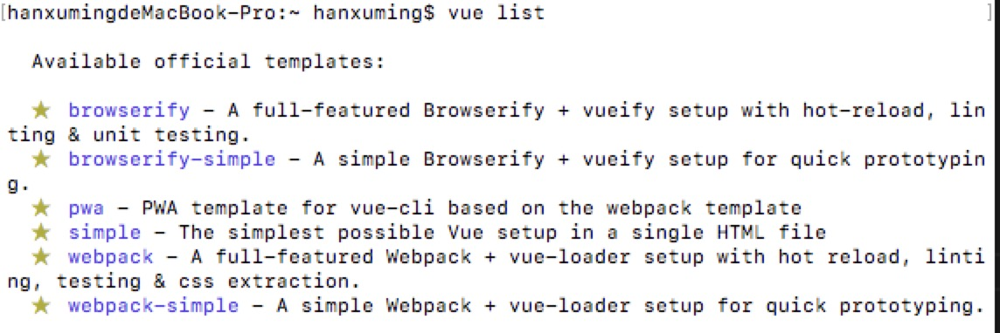

# 6.4 vue提供的几种脚手架模板

:::danger 问题一：vue-cli 提供的几种脚手架模板
:::

在使用之前，可以先用 `vue-list` 命令查询可用的模板。

详解：

vue-cli 提供了的常用的脚手架模板：

`webpack`：基于 webpack 和 vue-loader 的目录结构，而且支持热部署、代码检查、测试及 css 抽取。

`webpack-simple`：基于 webpack 和 vue-loader 的目录结构。

`browerify`：基于 Browerfiy 和 vueify(作用于 vue-loader 类似)的结构，支持热部署、代码检查及单元测试。

`browerify-simple`：基于 Browerfiy 和 vueify 的结构。

`simple`：单个引入 Vue.js 的 index.html 页面。

这里我们主要会使用 webpack 作为常用脚手架，可以运行 `vue init webpack my-project` 来生成项目。