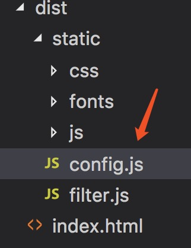

# 6.8 vue-cli生产环境使用全局常量

:::danger 问题一：如何定义一个常量，允许项目打包后，修改 [hash].js 里面的值
:::

第一步，在 static 下新建 config.js：

```bash
.
├── 项目路径
│   ├── static
│   │___├── config.js

```

第二步，在 config.js 里面设置全局变量：

```js
window.g = {
    PUBLIC_IP  : "http://10.10.10.10:8080"
}
```

第三步，在 index.html 里面引入：

```html
<script type="text/javascript" src="./static/config.js"></script>
```

第四步，在其他 .js 文件中即可使用：

```js
window.g.PUBLIC_IP
```

第五步，打包后修改：

通过 `npm run build` 命令打包后，此 config.js 文件会被打包到 `dist/static`文件夹下，



此时如果需要修改 `PUBLIC_IP`，打开`config.js`即可修改，无需重新打包！