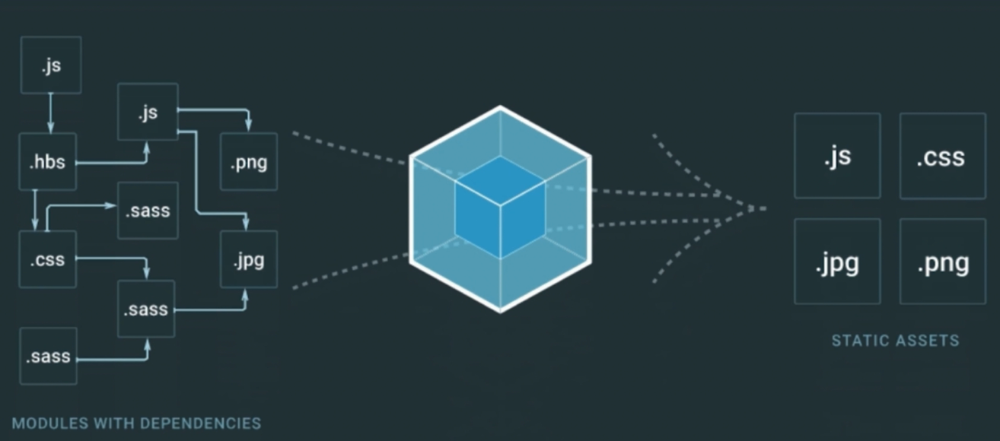
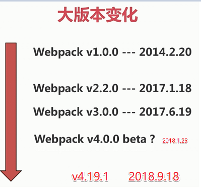
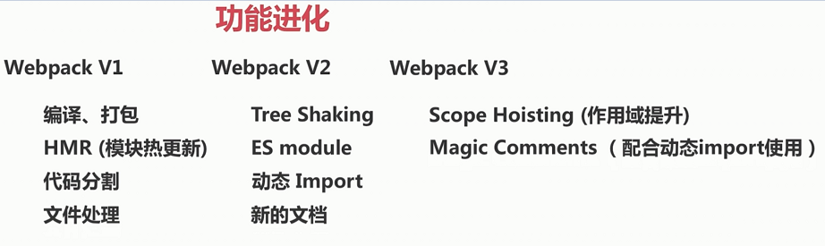
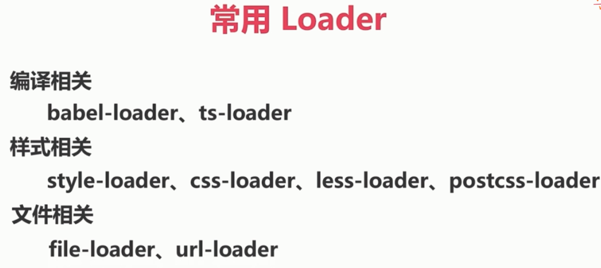
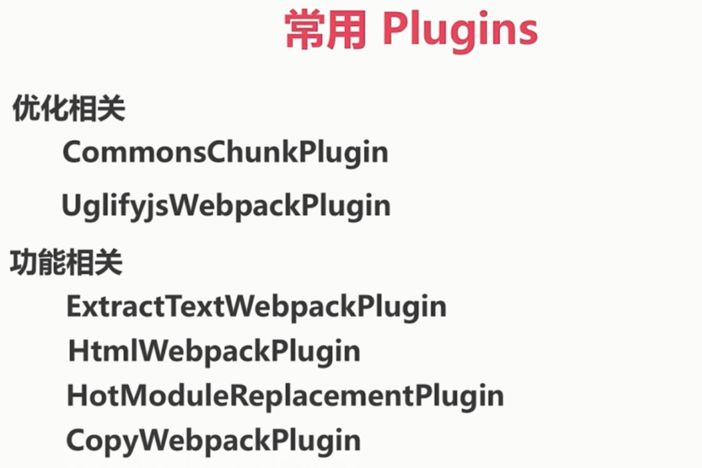

# Webpack 介绍及核心概念

[Webpack 官网](https://webpack.js.org/)

### webpak 概述





### 功能进化



### 核心概念 - Entry

代码的入口

打包的入口

单个或多个

```js
module.exports = {
  entry: 'index.js'
}
```

```js
module.exports = {
  entry: ['index.js', 'vendor.js']
}
```

推荐:

对象的好处, 可以知道文件对应的 key 是什么

```js
module.exports = {
  entry: {
    index: 'index.js'
    vendor: 'vendor.js'
  }
}
```

### 核心概念 - Output

打包生成的文件(bundle)

一个或多个

自定义规则

配合 CDN

一个:

```js
module.exports = {
  entry: 'index.js',
  output: {
    filename: 'index.min.js'
  }
}
```

多个:

```js
module.exports = {
  entry: {
    index: 'index.js'
    vendor: 'vendor.js'
  }
  output: {
    filename: '[name].min.[hash:5].js'
  }
}
```

### 核心概念 - Loaders

处理文件

转化为模块

```js
module.exports = {
  module: {
    rules: [
      {
        test: /\.css$/,
        use: 'css-loader'
      }
    ]
  }
}
```

常用 loader:



### 核心概念 - Plugins

参与打包的整个过程

打包优化和压缩

配置编译时的变量

极其灵活

```js
const webpack = require('webpack')

module.exports = {
  plugins: [
    new webpack.optimize.UglifyJsPlugin()
  ]
}
```

常用 plugins:



### 名词

- Chunk

代码块

- Bundle

打包后

- Module

模块(JS CSS 图片)
