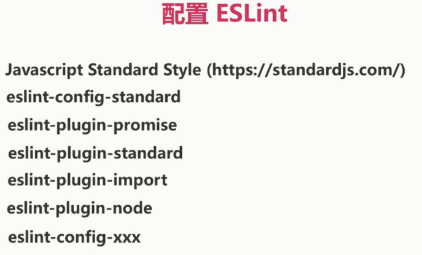
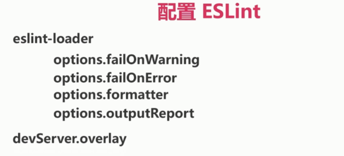
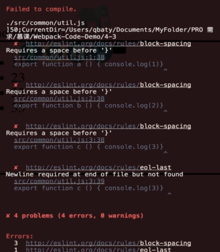

# 设置 ESLint 检查代码格式

eslint、eslint-loader、eslint-plugin-html、eslint-friendly-formatter

### 配置 ESLint

首先 webpack config

然后 `.eslintrc.*` 或者 package.json 中的 eslintConifg

### JavaScript Standard Style





### 实战

安装: `npm i eslint eslint-loader eslint-plugin-html eslint-friendly-formatter -D`

配置 webpack.config.js:

```js
devServer: {
  overlay: true, // 开启的话, 有错误会显示在页面
}
...
rules: [
  {
    test: /\.js$/,
    include: [path.resolve(__dirname, 'src')],
    exclude: [path.resolve(__dirname, 'src/libs')],
    use: [
      {
        loader: 'babel-loader',
        options: {
          presets: ['env'],
        }
      },
      {
        loader: 'eslint-loader', // 注意要在 babel-loader 之前
        options: {
          formatter: require('eslint-friendly-formatter')
        }
      }
    ]
  }
]
```

新建 `.eslintrc.js`:

`npm i eslint-config-standard eslint-plugin-promise eslint-plugin-node eslint-plugin-import eslint-plugin-standard -D`

```js
module.exports = {
  root: true,
  extends: 'standard', // 标准规范
  plugins: [
    'html'
  ],
  env: {
    browser: true,
    node: true
  },
  globals: {
    $: true // jquery
  },
  rules: {
    indent: ['error', 4] // 缩进
    'eol-last': ['error', 'nerver']
  }
}
```

