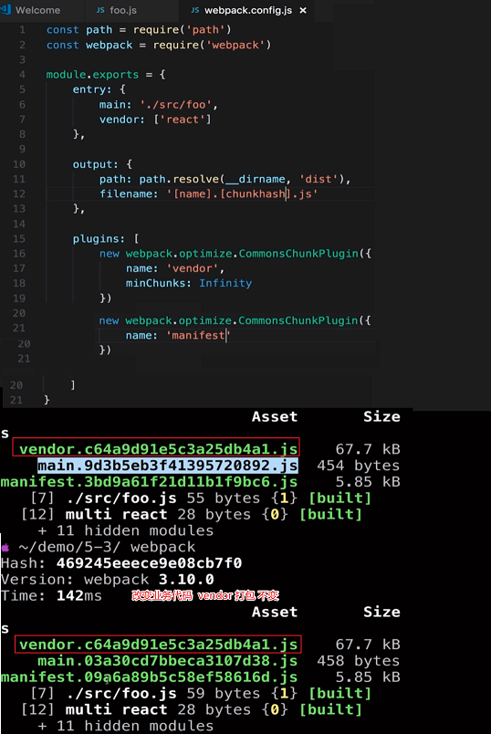
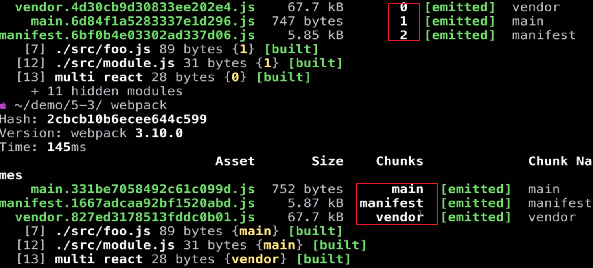
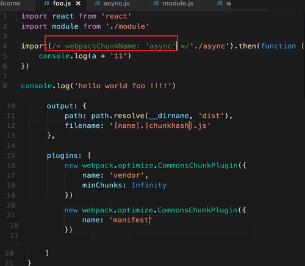

# 长缓存优化

什么是长缓存优化: 浏览器的长缓存.

场景: 希望改变 app 代码时, vendor 不变化

解决: 提取 vendor, hash -> chunkhash, 提取 webpack runtime

### 实战

- 业务代码和插件分开

提取 vendor, 设置 chunkhash, 提取 webpack runtime



### 引入新模块, 模块顺序变化, vendor hash 发生变化

解决:

NamedChunksPlugin、NamedModulesPlugin

配置 webpack.config.js:

```js
plugins: [
  new webpack.NamedChunksPlugin(),
  new webpack.NamedModulesPlugin(),
]
```



### 动态引入模块时, vendor hash 发生变化

解决: 定义动态模块的 chunkname



### 总结

独立打包 vendor

抽出 manifest(webpack runtime)

使用 NamedChunksPlugin

使用 NamedModulesPlugin